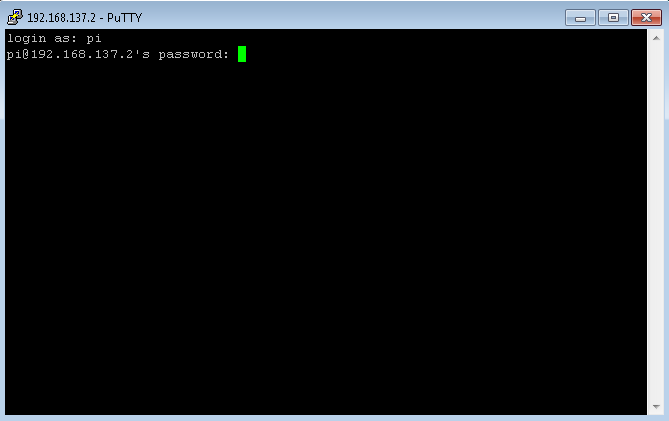

```{r setup}
knitr::opts_chunk$set(python.reticulate=FALSE)
```


# Teaser

Like it or not - bots and smart devices are becoming more and more popular.
If you want to be sure that your data stays with you, but you need some smart, customised system to water your plants, remind you and your flatmates to put the trash outside or you just want to control the lights within your home, the best solution is: DIY — do it yourself!
Also, this is a good chance to gain and enhance programming skills. We are going to use a Raspberry-Pi to run our own bots for the Messenger "Telegram", try to understand the pro- and cons of Telegram regarding data-securitiy, learn how to connect sensors to a Raspberry-Pi, and look at ways to monitor sensor data.

# Introduction

{width=25%}

The Raspberry Pi is a low-cost single-board computer.
Since the first Raspberry Pi was released in 2012, it has become a famous tool for DIY-projects, industrial automisation, research and educational purposes. 
It can be used just like a normal desktop computer by connecting a USB-mouse, USB-keyboard and monitor, but often it is also used "headless" without any of these. It also comes with multiple pins and connectors, so that it is easy to connect sensors to the Raspberry Pi.

{width=25%}

Telegram is a mostly open source messanger, which also has an API for writing own bots. These can be run on a Raspberry Pi.

{width=25%}

When collecting sensory data with a Raspberry Pi, e.g. in a DIY weather station, you get sensor values associated with time stamps, which is called time series data. A great option to store and access time series data is to use Grafana, a database system specialised for time series. Usually, Grafana runs on some other server, but it is also possible to host it on a Raspberry Pi.

There is a big community of people using the Raspberry Pi for all kind of projects who also share some instructions and photos. For example, you could follow some instructions to build a touchscreen internet radio, a simple timelapse camera using the Raspberry Pi and a coffee tin, etc.
A great selection of projects can be found on ["Instructables"] (https://www.instructables.com/circuits/raspberry-pi/projects/).

# Working with the Raspberry Pi

## Getting started

For the purpose of this course I preconfigured a Raspberry Pi system for you. It is on the micro-SD card in the envelope. Just take the micro-SD card out of the adapter and insert in the Raspberry Pi!


## The operating system
The standard operating system of the Raspberry Pi is called Raspberry Pi OS (previously Raspbian). There are two versions of it. One includes a desktop interface, which means that it comes with a graphical user interface as you know it from a normal laptop. The other one is a lite version, which can only be used "headless", without a graphical user interface.
The operating system is stored on a SD-card. For the purpose of this course I prepared a Raspberry Pi with a graphical user interface for you, so no need for you to worry about the operating system. If you come to the point that you want to set up your own Raspberry Pi, you need a SD-card reader and the micro SD-card itself. Then you can follow the instructions on [https://www.raspberrypi.org/software/](https://www.raspberrypi.org/software/)

## Using the Raspberry Pi as a desktop computer

If you want to use the Raspberry Pi as a desktop computer
you will need a USB keyboard, a USB mouse, and a monitor HDMI cable. (We are using the Raspberry Pi version 3B+.)

{width=75%}

The Raspberry Pi is booting as soon as you plug the power cable in.

Using the graphical user interface and also setting up a wifi connection is pretty straight forward. You can find some firther instruction here: [https://projects.raspberrypi.org/en/projects/raspberry-pi-using](https://projects.raspberrypi.org/en/projects/raspberry-pi-using)

## The Raspberry-Pi and SSH

{width=75%}

SSH stands for Secure Shell and is a protocol to communicate securely over a network. In the usual setting of a home network, you will need to connect both your laptop and the Raspberry Pi to the same router. You can use an ethernet cable or wifi. Then you can operate the Raspberry Pi using the command line. In the next chapters you will find more information on how to use SSH and the command line, and how to set up a wifi connection on the Raspberry Pi using an SSH connection.


{width=75%}


## Establishing a Wifi connection

### Option 1: Use keyboard, mouse and monitor

{width=50%}


If you are using the Raspberry Pi with keyboard, mouse and monitor, it is relatively easy to set up a wifi connection. You can find some detailed instructions here: [https://projects.raspberrypi.org/en/projects/raspberry-pi-using/3](https://projects.raspberrypi.org/en/projects/raspberry-pi-using/3)
Check if the wifi is working by opening a browser and entering some search term, e.g. "raspberry pi".


### Option 2: Ethernet Cable

{width=50%}

1. Connect the Raspberry Pi to your router using an ethernet cable. Your laptop should be in the same network, either using wifi or an other ethernet cable. Usually you have only one router at home, so you should be in the same network anyway.

2. Find the IP-adress of your Raspberry Pi. You have different options, as described in the next [chapter](#find-the-ip-address-of-your-raspberry-pi).

3. Connect to your Raspberry Pi through SSH. Follow the instructions in the chapter on [SSH](#connect) to connect to your Raspberry Pi.

4. You are now connected to your Raspberry Pi! Open the configuration page:
```{bash eval=F}
sudo raspi-config
```


Choose the second option "Network Option" and the second option "Wireless Lan". Follow the instructions.

5. Remove the cable. Retry to connect to your Raspberry Pi via ssh. You also might need to restart the Raspberry Pi.
If you manage to connect to your Raspberry Pi via ssh without the ethernet cable plugged in, it means that you set up the wifi connection successfully.

### Option 3: Edit a config file on the SD-card

{width=50%}

All the files of the operating system are stored on the Micro-SD card. There is also a config file for the wifi settings. Put the Micro-SD card into a card reader. Then follow the first three steps of this instruction page: [https://www.factoryforward.com/raspberry-pi-headless-wifi-setup/](https://www.factoryforward.com/raspberry-pi-headless-wifi-setup/)
Next, try to find your Raspberry's Ip and connect via ssh as described in the next chapters.


### Option 4: Make a hotspot with your mobile phone

Make a hotspot with following settings:

```{bash eval=F}
ssid (the name of the wifi-network): informatica
password: informatica
```

Connect your laptop to the same hotspot. Then follow the steps in the chapter of option 2, starting from the second step.


# Find the IP-address of your Raspberry Pi

## If you connected mouse, keyboard and monitor

In case you are using keyboard, mouse and monitor, open a terminal by klicking on the button in the upper left corner, or press Control-Alt-T to open a terminal.

Then enter:

```{bash eval=F}
ifconfig
```


## Angryip software
If you do not have that much experience with your router and the terminal, I recommend using the software [https://angryip.org/download/](https://angryip.org/download/). Install it on your laptop, launch it and use the proposed IP-range. Click on "start". You will find a list of devices connected to the same network as yours. Search for the Raspberry Pi.


## Command line
Using the command line of your laptop, you can scan for devices that are in the same network as yours. So you can do the same as the Angryip software using the command line

Instructions for Linux: [https://www.tecmint.com/find-live-hosts-ip-addresses-on-linux-network/](https://www.tecmint.com/find-live-hosts-ip-addresses-on-linux-network/)

Instructions for Windows: [https://techwiser.com/find-ip-address-of-any-device/](https://techwiser.com/find-ip-address-of-any-device/)

Instructions for Mac: [https://osxdaily.com/2016/11/03/view-lan-device-ip-address-arp/](https://osxdaily.com/2016/11/03/view-lan-device-ip-address-arp/)

If you do not know which of the listed IPs is your Raspberry's address, you can run it twice - once with the Raspberry connected to LAN, once without it. Then see which address is missing.

## Using your router's administration page
If you have access to you router's administration page, you can check for your Raspberry Pi there.
Here are some instructions on how to access your the administration page: https://www.lifewire.com/accessing-your-router-at-home-818205

# Using SSH and the command line

## The basics


### Finding your IP

You will need to know the IP address of your Raspberry Pi. In case you followed the instruction on [how to connect to wifi using an ethernet cable](#option-2-ethernet-cable), you already know the IP address of your Raspberry Pi.  Otherwise follow the instructions in the [IP chapter](#find-the-ip-address-of-your-raspberry-pi).

### Connect!

Once you got the IP-address, type:

```{bash eval=F}
ssh pi@<your-raspberrys-IP>
```


The default user of the Raspberry Pi is "pi". The default password is "raspberry". So we use the command "ssh", the user name, and the host information.
Next, you have to enter the password. You wont see anything while you are typing for security reasons. Press enter.


```{bash eval=F}
user: pi
password: raspberry
```

If it is the first time connecting to the Raspberry Pi, you might encounter following message:

```{bash eval=F}
The authenticity of host '<host-name>' can't be established.
RSA key fingerprint is 3f:1b:f4:bd:c5:aa:c1:1f:bf:4e:2e:cf:53:fa:d8:59.
Are you sure you want to continue connecting (yes/no)?
```

Just type yes and press enter.

The first line in the terminal should change from the name of your laptop to something like following:

```{bash eval = F}
pi@raspberrypi:~ $ 
```

Congratulations! You succesfully connected to the Raspberry Pi.


##  If some thing is not working - Installing and Enabling SSH

You might configure SSH on your own laptop. It is already enabled on the Raspberry Pi.

### Installation on Linux

SSH should normally be installed and enabled. Just try it out! In case it is not working, you will find some instructions for the installation on: [https://www.ubuntupit.com/how-to-install-configure-and-enable-ssh-service-in-linux/](https://www.ubuntupit.com/how-to-install-configure-and-enable-ssh-service-in-linux/)

### On Windows

SSH client should be usually installed and activated. If something does not work, you can check out the instruction on [https://www.pugetsystems.com/labs/hpc/How-To-Use-SSH-Client-and-Server-on-Windows-10-1470/](https://www.pugetsystems.com/labs/hpc/How-To-Use-SSH-Client-and-Server-on-Windows-10-1470/)

### On Mac

SSH should be activated as default.


## Using the command line

### List files
list files in current directory:
```{bash eval=F}
ls
```

list files in sub-directory:
```{bash eval=F}
ls <sub-directory>
```

list files with specific ending:
```{bash eval=F}
ls *.<ending>
```

list files with more infos, hidden files
```{bash eval=F}
ls -lah
```

show all options for ls:
```{bash eval=F}
 ls --help
```

### Change the current directory

change to sub-directory:

```{bash eval=F}
cd <sub-directory>
```

change to sub-sub-directory:
```{bash eval=F}
cd <sub-directory>/<sub-sub-directory>
```

change to parent-directory:
```{bash eval=F}
cd ..
```

change to parent-parent directory:

```{bash eval=F}
cd ../..
```

### show file

```{bash eval=F}
cat <file-name>
```

### edit file

```{bash eval=F}
nano <file-name>
```
Type something/ delete something, use arrow-keys to move cursor.

To save and exit press Control-X

Confirm that you want to save changes/ indicate that you do not want to save it with "y" or "n".

### run a python script

using python 3:

```{bash eval=F}
python3 <script-name>
```

## copying a file

```{bash eval=F}
cp <file-to-be-copied> <new-file-name>
```

## Copying single files using ssh

If the file to be copied is on your laptop:
```{bash eval=F}
scp <file-to-be-copied> pi@<ip-address>:./<path-from-home-dir>
```

If the file to be copied is on the Raspberry Pi:
```{bash eval=F}
scp pi@<ip-address>:./<path-from-home-dir> <file-to-be-copied>
```

### Synchronising directories using scp

If you are using your Raspberry Pi "headless", without monitor, keyboard and mouse, copying a bunch of files from your laptop to the Raspberry Pi will be an important part of your workflow.

You can code your scripts using your favourite editor on your laptop. Keep all files you need in the same parent directory, without other, useless stuff in it.

Then you can copy all files using:

```{bash eval =F}
rsync -avz <directory-name> pi@<ip-address>:./<path>
```

If you make some changes to single files and use the command again, only the updated files will be copied.

-avz are optional parameters.
-a is a very common option, which is actually a abbreviation for multiple options, e.g. to preserve modification times.
-v stands for verbose, giving you more information about the progress of the synchronisation progress.
-z invokes some compressing, which is useful for slow connections
You can read more about it here: [https://www.redhat.com/sysadmin/sync-rsync](https://www.redhat.com/sysadmin/sync-rsync)

# Hardware

## Pinout

There are two 3.3 V pins, and two 5 V pins. This pins are always on, always send power as default.
Also, there are 8 Ground pins.

Most pins are GPIO pins - general-purpose input/output pins. They can send or receive 3.3 V. Generally, they are used to send some signal, e.g. to switch a relay.
Some of the GPIO pins are capable to work with some specialised communication interfaces. For example, there are two pins to be used with the IC2 protocol, the clock line (SCL) and the data line (SDA). The BME280 sensor we are using for humidity, temperature and pressure measurments is a IC2 sensor.

## Cables


Mostly, you can use jumper wires to connect the pins of the Raspberry Pi with some electrical components. They come with different endings: male, female, or some special connectors.
Sometime, you might need to use some other cables, e.g. to connect your water pump to a relay. Therefore you might need to remove the insulation of the cable. There is a great wikihow on how to do this: [https://www.wikihow.com/Strip-Wire](https://www.wikihow.com/Strip-Wire)


https://www.wikihow.com/Strip-Wire#/Image:Strip-Wire-Step-8.jpg, CC
https://www.wikihow.com/Strip-Wire#/Image:Strip-Wire-Step-6.jpg, CC
https://commons.wikimedia.org/wiki/File:A_few_Jumper_Wires.jpg, CC


## Resistors


Resistors are used e.g. to adjust the current flow or to adjust the level for some signal processing. They all come with a colour code you can check to find the size of your resistor. There are also online calculators for that, e.g. this one: [https://resistorcolorcodecalc.com/](https://resistorcolorcodecalc.com/)

https://commons.wikimedia.org/wiki/File:3_Resistors.jpg


## Relay

A relay is a switch that can be operated by an electical signal. It can close an electrical circuit which requires some higher voltage or ampere, for example for an LED, or a pump to water your garden.
To operate the relay, you need to connect voltage, ground and a GPIO pin. You can use 3.3 V or 5 V. Some relais might require 5 V, but if you use 5V you should additionally add a resistance between the GPIO pin and the relay.


https://freesvg.org/1554744391, CC
https://commons.wikimedia.org/wiki/File:Led_light_bulb_-_led_lamp_1.png, CC
https://pixabay.com/vectors/socket-electricity-power-electric-280947/


# Exercises Day 1

## Change password

Change the default password of the user using:

```{bash eval=F}
sudo raspi-config
```


## Reboot 

Open a terminal on the Raspberry Pi. Type:

```{bash eval=F}
sudo reboot
```

The Raspberry should reboot.


## List files

List all files in the home directory of the Raspberry Pi.

List all files in the sub-directory "Documents"

Is there an other directory in "Documents"? List its contents as well.

## make a Readme file/ take some notes

Create a file using "nano" from the terminal. Name it "readme" or "notes".
Write some words and save the file.

## copy a file

Use "cp" to make a copy of the file you just created.
Use "cat" to show the content of the file, to see if everything is there.

## Python - Hello World

Using your laptop create a file called "HelloWorld.py". Insert following line:

```{python eval=F}
print("Hello World")
```

Copy the file using scp.

Run the script using python3.

## BME280 

Connect the BME280 to the Raspberry Pi:


Download the folder "informaticaBremenBot". Use rsync to transfer the files to the /Documents directory of the Raspberry Pi.

Run the file "measure_bme.py" using python3.

You should be able to see the measurements taken with the BME280.

## Your own project

### Ideas

If you do not have an idea for your own project yet, but you would like to have one, you can check 
[Link to "Instructables"] (https://www.instructables.com/circuits/raspberry-pi/projects/)

What would be useful for your home/ your family/ your friends?

### Collect the material you need

You might need to get some material. If you just want to code a bot without any sensors, that is also fine, we are going to learn how to do that tomorrow.

### Make a plan

Find out how to install the hardware. Look out for datasheets of your products or instructions. Optimally, you find a graphic on how to connect everything, or you draw it yourself. Contact me, if you need some help.

### Connect and test

Connect everything and make a simple test, e.g. just using the terminal or writing a simple script.
It is always good to know that everything is working before you embed it into some other code, e.g. the telegram bot.


# Telegram

## Security

A message can be send as plain text, or it can be encrypted in some way.
If a message is encrypted on all its way from the sender to the recipient, this is called
end-to-end encryption. If a message is encrypted on its way from the sender to a server, decripted, re-encrypted, and then transferred to the recipient, this is called encryption-in-transit or server-client-encryption.
Telegram supports both encryption types.
If you want to use end-to-end encryption, you have to go for secret chats. If you are interested in the details of Telegram's symmetric end-to-end encryption you can read this: [https://core.telegram.org/api/end-to-end](https://core.telegram.org/api/end-to-end)
The default encryption scheme of telegram is server-client-encryption. This means, that messages cannot be read, e.g. by somebody having power over a wifi-router, but they could theoretically be read by telegram on the server side. However, Telegram states that it saves keys on servers at different locations, so that it is not possible for a single engineer to read any messages.
Server-client-encryption allows for a cloud based system. In this way, you can read your messages on multiple devices, you do not need to worry about backups and everything run quite fast.

Telegram uses a custom encryption scheme called MTProto. It has often been criticised for its custom design, as there has not been any formal proof that it is reliable and secure. However, in December 2020 a paper has been published giving some formal verification.
Telegram offers up to 300 000 dollar for somebody finding some security issue. Every now and then, programmer or scientist discover some vulnerabilities, e.g. described in this article:[https://mybroadband.co.za/news/security/406466-big-problems-with-telegram-security.html](https://mybroadband.co.za/news/security/406466-big-problems-with-telegram-security.html)

Most of Telegrams source code is open source, except the code running on Telegram's server.

Telegram can be a platform for  illegal activities such as illegal pornography or stolen personal data, and it also has been used for communication by far-right-groups.

It can also be a tool for political activism in dictatorial countries and has been blocked by several governments.


## Security tipps

- You can set an auto-delete timer for messages
- in some client apps, you can set a passphrase to avoid other people reading your messages when they got access to your device
- there is an option to hide your phone number: [https://www.howtogeek.com/713715/how-to-hide-your-phone-number-in-telegram/](https://www.howtogeek.com/713715/how-to-hide-your-phone-number-in-telegram/)

## Creating a telegram bot


Bots are like normal Telegram accounts, but they are operated by programs.

To create a new bot, you need to search for the botfather. I always found it strange, that the botfather is called botfather. Apparently, this because of the movie Godfather, a 1972 American crime film...

Howevere, search for the botfather and click on start:


Then use the /newbot command. You can either press on the button with the "/", or just type the command directly into the chat.
Follow the instructions of the botfather. You will need to choose a name and a username for your bot.
In the end, the botfather will send you an access token. Copy this token.

Open the file bot.py

You will need to insert your token here, in the Updater function:


e.g. 
```{python eval =F}
updater = Updater('12414235252:gshgskghskjhwiuhfhskjfshvbjfhi')
```

Run the script bot.py using

```{bash eval=F}
python3 bot.py
```


Theoretically, your bot is online now! Search for your bot in telegram using its name or follow the link supplied by the botfather:


You can try the commands /hi or /time.

But... Per default, all bots are public. I assume you do not want to have a public bot (yet). So we limit it to certain chats. You need to manually add a chat-id before somebody can use your bot.

So, type /hi. Your bot should not greet you back.

But in the terminal window you use to run your bot, you should be able to see the chat-id of your private chat with the bot.


Copy this id and insert it in bot.py:


You can delete 123 and insert your chat-id instead, you can also insert multiple chat-ids, seperated by comma.

Re-run the script bot.py

Now you can try to chat with the bot again using the commands /hi or /time. This time you should get an answer.


<!-- Dutch website Tweakers reported that an invited bot can potentially read all group messages when the bot controller changes the access settings silently at a later point in time. -->

## Adding a command

```{python eval=F}
def greet(update, context):
    # send a greeting
    if check_id(context, update):
        update.message.reply_text("Hi! I'm the Informatica Feminale Bot.")


```

A function that implements a command needs the update object ("update") and the context ("bot").
We are using "check_id" to make our bot private, only answering in chats with certain chat-ids.
"Reply_text" is one of many predefined functions from the telegram package. It will send the text in the chat.

If you want that the user sees the command's name and description when starting to type or using the "/"-button, you have to add it by chatting with the botfather:


## Reading and responding to messages

The bot can read and respond even to all "normal" messages sent in the chat. The message can be obtained using "update.message.text":

```{python eval=F}
def echo(update, context):
    """Echo the user message."""
    update.message.reply_text(update.message.text)
```

In order to make the bot read the messages, you need to add a MessageHandler. You can filter the messages. In this case we are reading and responding to normal text-messages, but not to commands.

```{python eval=F}
# on non command i.e message - echo the message on Telegram
    dp.add_handler(MessageHandler(Filters.text & ~Filters.command, echo))
```
 
 
 
## Using the job queue

Your bot can perform a certain action and send a message after a certain amount of time, if you want repeatedly.

You can use the following functions: run_daily / run_monthly, run_once and run_repeating.

### job queue example
Let us look at an example first.
Imagine you want to set a timer, e.g. to allow the user to time 10 seconds.


```{python eval=F}
def alarm_10(job_context):
    job_context.bot.send_message(chat_id=job_context.job.context,
                             text='Drrrrrrring!!! 10 seconds passed.')

def set_alarm_10(update, context):
    chat_id = update.message.chat_id
    job = context.job_queue
    job.run_once(alarm_10, 10, context=chat_id, name=str(chat_id))
```

We have a function "set_alarm_10" which is basically like the other functions we add to the handler. The user can use a command to run this function. It shedules the job to induce an other function "alarm_10", which is the actual alarm, after 10 seconds.

Within this function we first obtain the chat_id of the chat where the command was used.

```{python eval=F}
chat_id = update.message.chat_id
```

We then obtain our job queue:

```{python eval=F}
job = context.job_queue
```

And then we use run_once:
*alarm_10* is the name of the function we want to call. 
*10* means, we want to call it after 10 seconds.
We also pass the chat_id as context, and its name.

```{python eval=F}
job.run_once(alarm_10, 10, context=chat_id, name=str(chat_id))
```

The message to be called has the job-queue as a parameter. Using this we can send a message:

```{python eval=F}
def alarm_10(job_context):
    job_context.bot.send_message(chat_id=job_context.job.context,
                             text='Drrrrrrring!!! 10 seconds passed.')
```


### job queue functions

(copied from [https://python-telegram-bot.readthedocs.io/en/stable/telegram.ext.jobqueue.html](https://python-telegram-bot.readthedocs.io/en/stable/telegram.ext.jobqueue.html))

```{python eval=F}
run_daily(callback, time, days=(0, 1, 2, 3, 4, 5, 6), context=None, name=None, job_kwargs=None)
```

Creates a new Job that runs on a daily basis and adds it to the queue.

*callback*: The callback function that should be executed by the new job. Callback signature for context based API: def callback(CallbackContext)

*time (datetime.time)* – Time of day at which the job should run. If the timezone (time.tzinfo) is None, the default timezone of the bot will be used.

*days (Tuple[int], optional)* – Defines on which days of the week the job should run (where 0-6 correspond to monday - sunday). Defaults to EVERY_DAY

*context (object, optional)* – Additional data needed for the callback function. Can be accessed through job.context in the callback. Defaults to None.

*name (str, optional)* – The name of the new job. Defaults to callback.__name__.

*job_kwargs (dict, optional)* – Arbitrary keyword arguments to pass to the scheduler.add_job().


```{python eval=F}
run_monthly(callback, when, day, context=None, name=None, day_is_strict=True, job_kwargs=None)
```

Creates a new Job that runs on a monthly basis and adds it to the queue.

*callback (callable)* – The callback function that should be executed by the new job. Callback signature for context based API: def callback(CallbackContext)

*when (datetime.time)* – Time of day at which the job should run. If the timezone (when.tzinfo) is None, the default timezone of the bot will be used.

*day (int)* – Defines the day of the month whereby the job would run. It should be within the range of 1 and 31, inclusive.

*context (object, optional)* – Additional data needed for the callback function. Can be accessed through job.context in the callback. Defaults to None.

*name (str, optional)* – The name of the new job. Defaults to callback.__name__.

*day_is_strict (bool, optional)* – If False and day > month.days, will pick the last day in the month. Defaults to True.

*job_kwargs (dict, optional)* – Arbitrary keyword arguments to pass to the scheduler.add_job().


```{python eval=F}

run_once(callback, when, context=None, name=None, job_kwargs=None)

```

Creates a new Job that runs once and adds it to the queue.

*callback (callable)* – The callback function that should be executed by the new job. Callback signature for context based API: def callback(CallbackContext)

*when (int | float | datetime.timedelta | datetime.datetime | datetime.time)* – Time in or at which the job should run. This parameter will be interpreted depending on its type.

int or float will be interpreted as “seconds from now” in which the job should run.

datetime.timedelta will be interpreted as “time from now” in which the job should run.

datetime.datetime will be interpreted as a specific date and time at which the job should run. If the timezone (datetime.tzinfo) is None, the default timezone of the bot will be used.

datetime.time will be interpreted as a specific time of day at which the job should run. This could be either today or, if the time has already passed, tomorrow. If the timezone (time.tzinfo) is None, the default timezone of the bot will be used.

*context (object, optional)* – Additional data needed for the callback function. Can be accessed through job.context in the callback. Defaults to None.

*name (str, optional)* – The name of the new job. Defaults to callback.__name__.

*job_kwargs (dict, optional)* – Arbitrary keyword arguments to pass to the scheduler.add_job().


```{python eval=F}
run_repeating(callback, interval, first=None, last=None, context=None, name=None, job_kwargs=None)
```

Creates a new Job that runs at specified intervals and adds it to the queue.

*callback (callable)* – The callback function that should be executed by the new job. Callback signature for context based API: def callback(CallbackContext)

*interval (int | float | datetime.timedelta)* – The interval in which the job will run. If it is an int or a float, it will be interpreted as seconds.

*first (int | float | datetime.timedelta | datetime.datetime | datetime.time, optional)* – Time in or at which the job should run. This parameter will be interpreted depending on its type.
int or float will be interpreted as “seconds from now” in which the job should run.

datetime.timedelta will be interpreted as “time from now” in which the job should run.

datetime.datetime will be interpreted as a specific date and time at which the job should run. If the timezone (datetime.tzinfo) is None, the default timezone of the bot will be used.
datetime.time will be interpreted as a specific time of day at which the job should run. This could be either today or, if the time has already passed, tomorrow. If the timezone (time.tzinfo) is None, the default timezone of the bot will be used.
Defaults to interval

*last (int | float | datetime.timedelta | datetime.datetime | datetime.time, optional)* – Latest possible time for the job to run. This parameter will be interpreted depending on its type. See first for details.
If last is datetime.datetime or datetime.time type and last.tzinfo is None, the default timezone of the bot will be assumed.
Defaults to None.

*context (object, optional)* – Additional data needed for the callback function. Can be accessed through job.context in the callback. Defaults to None.

*name (str, optional)* – The name of the new job. Defaults to callback.__name__.

*job_kwargs (dict, optional)* – Arbitrary keyword arguments to pass to the scheduler.add_job().


### daily example

We need the callback function:
```{python eval=F}
def trash(job_context):
    job_context.bot.send_message(chat_id=main_chat_id,
                             text="It's Wednesday. Don't forget to put the trash outside!")
   
```

And need to schedule the job, e.g. in our main function:

```{python eval=F}
 j.run_daily(trash, days=(2,),time = datetime.time(hour = 16, minute = 0, second = 0))
```


## Simple conversation

First, think about how the conversation should go. How is going to start? By a command, or if the user uses a certain keyword?
What are the different states of the conversation? When is it going to end.
You can draw a state diagram for that.

As an example we take a bot who is triggered by the word "boring". The bot then asks if it should tell some random facts. If not, it asks if it should come up with some tongue twists.
(All facts and tongue twists were found on Wikipedia are CC-licensed.)


A state diagram for that could look like this:


We define the states as global parameters:

```{python eval=F}
FUNFACTS, TONGUE_TWIST = range(2)
```

In the main function we define a conversation handler and add it to the dispatcher:

```{python eval=F}
conv_handler = ConversationHandler(
        entry_points=[MessageHandler(Filters.regex('.*boring.*'), start_conversation)],
        states={
            FUNFACTS: [MessageHandler(Filters.regex('^(y|yes|Yes|n|no|No)$'), more_funfacts)],
            TONGUE_TWIST: [MessageHandler(Filters.regex('^(y|yes|Yes|n|no|No)$'), tongue_twist)]
        },
        fallbacks=[MessageHandler(~Filters.regex('^(y|yes|Yes|n|no|No)$'), bye), CommandHandler('cancel', bye)],
    )

    dp.add_handler(conv_handler)
```

The regular expression '.*boring.*' makes that the conversation starts, whenever a user writes a message with the word 'boring'. In that case the function start_conversation is called.

```{python eval=F}
def start_conversation(update, context):
    reply_keyboard = [['Yes', 'No']]

    update.message.reply_text(
        'Are you bored? '
        'Do you want me to tell you some random fact?',
        reply_markup=ReplyKeyboardMarkup(
            reply_keyboard, one_time_keyboard=True, input_field_placeholder='Random facts?'
        ),
    )

    return FUNFACTS
```

It creates some buttons, a reply keyboard.


The answer is given to the function more_funfacts:

```{python eval=F}
def more_funfacts(update, context):
    if update.message.text.lower() in ['yes', 'y', 'Yes']:
        reply_keyboard = [['Yes', 'No']]
        fact = funfact_helper()
        update.message.reply_text(fact)
        update.message.reply_text(
            'Do you want more facts?',
            reply_markup=ReplyKeyboardMarkup(
                reply_keyboard, one_time_keyboard=True, input_field_placeholder='Random facts?'
            ),
        )
        return FUNFACTS
    else:
        reply_keyboard = [['Yes', 'No']]
        update.message.reply_text("Ok, should I give you a random tongue twist instead?",
        reply_markup=ReplyKeyboardMarkup(
            reply_keyboard, one_time_keyboard=True, input_field_placeholder='Random tongue twist?'
        ),)
        return TONGUE_TWIST
```

If the answer was "yes", we will get a random fact and are asked if we want more.
If the answer was "no", we will be asked if we want a tongue twist. In this case, tongue_twist is called:

```{python eval=F}
def tongue_twist(update, context):
    if update.message.text.lower() in ['yes', 'y', 'Yes']:
        reply_keyboard = [['Yes', 'No']]
        update.message.reply_text(tongue_twist_helper())
        update.message.reply_text(
            'Do you want another tongue twist?',
            reply_markup=ReplyKeyboardMarkup(
                reply_keyboard, one_time_keyboard=True, input_field_placeholder='Random tongue twist?'
            ),
        )
        return TONGUE_TWIST
    else:
        return bye(update, context)
```

Finally, if the user does not want to have a tongue twist anymore, the bot says good bye. This also happens if the user answers none-sense or uses the "/cancel"-command.

```{python eval=F}
def bye(update, context):
    update.message.reply_text(
        'Bye! Have a nice day. Hope you are not bored anymore', reply_markup=ReplyKeyboardRemove()
    )
    return ConversationHandler.END

```


## Inline Bots

Can be used in any chat. To see an example look at @stickers. E.g. write @stickers to your saved messages, follow the link and start the bot. From now on, you can use @stickers in combination with an emoji in any chat. If you want your own bot to work in inline mode send /setinline to the botFather.

## More resources

Here is the API: [https://python-telegram-bot.readthedocs.io/en/stable/](https://python-telegram-bot.readthedocs.io/en/stable/)

And here are some great examples: [https://github.com/python-telegram-bot/python-telegram-bot/tree/master/examples](https://github.com/python-telegram-bot/python-telegram-bot/tree/master/examples)


# Exercises Day 2

## Your first bot

Create your own bot by chatting with the botfather. Insert the token into bot.py. Copy the file to the Raspberry Pi. Test your bot using the commands "/hi" and "/time".

## /sense

Connect the BME280 and test the "/sense" command. Maybe you want to make the output a bit nicer as well, adding some more text or some other formating.

## add your own command

Create a new function and add it to the command handler.  For example you could implement a /joke command and have the bot tell you a joke. /weekday could give you the current weekday.

## embed your own hardware

If you are working on an own project, write a command to control the hardware you use. If you have an additional sensor, write a command to obtain some data from it. If you are using a relais, write a command to open/ close it.

## Implement your own timer

For example you could implement an alarm to remind you to feed the cat, water the plants, ...

## Implement your own conversation

Ideas:

A bot that tells some riddle and checks if the solution is correct.

A bot that gives you some maths to do.

A bot that lets you choose a topic and gives some information about that topic.

## Check out other examples

Check out other examples of bots to get to know what is considered "good style" and what is possible.

[https://github.com/python-telegram-bot/python-telegram-bot/tree/master/examples](https://github.com/python-telegram-bot/python-telegram-bot/tree/master/examples)

# RaspAP

In order to host Grafana, I configured the option to use the Raspberry Pi as an Access Point. This means, that your Raspberry Pi will be functioning similiarly to a router. It will create its own wifi-network and you can use other devices to log into it.
However, the Raspberry Pi itself wont be able to connect to wifi anymore. If you want to maintain a connection to the Internet, e.g. to be able to run your Telegram bot and use RaspAP with Grafana at the same time you will need to connect your Raspberry Pi to your main router using an ethernet cable.

## Enable access point

```{bash eval=F}
sudo systemctl enable hostapd dnsmasq
```
uncomment the static IP config in /etc/dhcpcd.conf
add the line "nohook wpa_supplicant"

Your file should look somehow like this:

```{bash eval=F}
# RaspAP wlan0 configuration
hostname
clientid
persistent
option rapid_commit
option domain_name_servers, domain_name, domain_search, host_name
option classless_static_routes
option ntp_servers
require dhcp_server_identifier
slaac private
nohook lookup-hostname
interface wlan0
nohook wpa_supplicant
static ip_address=10.3.141.1/24
static domain_name_server=1.1.1.1 8.8.8.8

```

Reboot:

```{bash eval=F}
sudo reboot
```


## Disable access point:

```{bash eval=F}
 sudo systemctl disable hostapd dnsmasq

```

comment the static ip config in /etc/dhcpcd.conf and the line "nohook wpa_supplicant":

```{bash eval=F}
sudo nano /etc/dhcpcd.conf
```

Your file should look like this:

```{bash eval=F}
# RaspAP wlan0 configuration
hostname
clientid
persistent
option rapid_commit
option domain_name_servers, domain_name, domain_search, host_name
option classless_static_routes
option ntp_servers
require dhcp_server_identifier
slaac private
nohook lookup-hostname
#nohook wpa_supplicant
#static ip_address=10.3.141.1/24
#static domain_name_server=1.1.1.1 8.8.8.8
```


```{bash eval=F}
sudo reboot
```

## How to see which services are running

```{bash eval=F}
systemctl list-units --type=service
```


## Login

After you enabled the Access Point, wait until your Raspberry Pi started again. After some time you should be able to see a wifi network called "raspberry" using your mobile phone or your laptop.

You can login using following information:

```{bash eval=F}
SSID: raspberry
Password: temperature
```


## Access Point administration page

Just like your wifi-router, RaspAp has its own administration page. You can access it using following information:

```{bash eval =F}
IP: 10.3.141.1
User: admin
Password: secret
```


For example, you can change the ssid (the name of the wifi-network) or the password.

## Using the access point and ssh

Even if your raspberry does not have an internet connection anymore, you can access it using ssh if your other device logged into the Access Point (raspberry). Just follow the instructions on finding the IP and using ssh in the previous chapters. 

# Grafana

## The setup

Grafana is a great tool to visualise your data. It works with different data sources. We are going to use it with InfluxDB, a database optimised for time series data.

In a normal setup, you would have multiple sensor nodes, for example Raspberry Pis. They collect some sensor data and transfer it to a server, e.g. using https. On the server the data is stored in an InfluxDB. Grafana sources data from this InfluxDB.


In our setup at the summer university the Raspberry Pi is both, sensor node and server!


## Collect some data

Connect your BME280 to your Raspberry Pi and run "send_bme.py".

```{python eval=F}
from os import path, listdir, system
from time import sleep
from influxdb import InfluxDBClient
import sensor_bme280

client = InfluxDBClient(host='localhost', port=8086, username='honig', password='waffel', database='home')

bme280 = sensor_bme280.BME280()

url = 'http://localhost:8086/write?db=home'
metrics = {}
metrics['measurement'] = "sensors"
metrics['tags'] = {}
metrics['tags']['key'] = 'test'

while True:
    metrics['fields'] = {}
    data = {}
    try:
        data = bme280.measure()
    except:
        print("Could not read sensor bme")

    metrics['fields']["Temperature"] = data["Temperature"]
    metrics['fields']["Humidity"] = data["RelHumidity"]
    metrics['fields']["Pressure"] = data["Pressure"]

    client.write_points([metrics])

    sleep(20)

```

The Raspberry Pi is going to measure data from the BME280 every 20 seconds and stores it into the InfluxDB.

## Use grafana

If you are using the Raspberry Pi with a monitor open http://localhost:3000

If you enabled the access point, you can also use some other device, connect it to the access point and open http://10.3.141.1:3000

Login using following information:

```{bash eval=F}
User: admin
Password: waffel
```

Choose the BME dasboard.


If you click on the little arrow on the upper right corner of the panel (the temperature graph), you can choose to edit the panel:


# Exercises Day 3

## Add more panel for BME280

Add a panel for humidity and another panel for pressure.

## Add a panel for your own data

Add a new dashboard or add extra panel for your own sensors.

## Here are some other ideas

But to be honest I have not tried all of this myself. But it is possible.


### Grafana alerts for telegram

Enable alerts from Grafana for your telegram bot: [https://gist.github.com/dl6nm/c312acbc6fddf1a56d749e045f040ca3](https://gist.github.com/dl6nm/c312acbc6fddf1a56d749e045f040ca3)

### Embed a Grafana plot in telegram

[https://community.hiveeyes.org/t/hiveeyes-data-in-telegram-bot/861](https://community.hiveeyes.org/t/hiveeyes-data-in-telegram-bot/861)


### Telegram and Influx

Find out how to access the influxDB from python to obtain time series data of a specific range. Using python, create a plot and send it to the telegram chat.

## Work on your own project :)


# More Raspberry Pi lifehacks

## Run a script on startup

Type 

```{bash eval=F}
crontab -e
```

and add a line to the end of the file:

```{bash eval=F}
@reboot python3 /home/pi/<path-to-your-file> &
```


## Install an image

[https://www.raspberrypi.org/documentation/computers/getting-started.html#using-raspberry-pi-imager](https://www.raspberrypi.org/documentation/computers/getting-started.html#using-raspberry-pi-imager)

## Make your own image

### Windows

Follow the instructions here to create the image file: [https://howchoo.com/g/nmexndnlmdb/how-to-back-up-a-raspberry-pi-on-windows](https://howchoo.com/g/nmexndnlmdb/how-to-back-up-a-raspberry-pi-on-windows)

If your SD-card used to be 30 GB, your image file will have the same size, even if there are empty blocks on it. There are some instructions on how to resize your image file on windows available in the internet, but there does not seem to be a really reliable option. Feel free to check them out anyway, or ask a friend who is using Mac or Linux.

### Mac

If you want to use a GUI try this to create the image file: [https://www.tweaking4all.com/software/macosx-software/applepi-baker-v2/](https://www.tweaking4all.com/software/macosx-software/applepi-baker-v2/)

If you are familiar with the bash you can also follow the instructions for Linux.

Follow this instructions to resize the image: [https://florianmuller.com/quickly-resize-and-shrink-raspberry-pi-sd-card-image-on-macos](https://florianmuller.com/quickly-resize-and-shrink-raspberry-pi-sd-card-image-on-macos)

### Linux

List all devices using:

```{bash eval=F}
sudo fdisk -l
```

Look out for the SD-card, e.g. looking at its size.
Copy its name.

Create the image. Use the name for the if-option and the destination for of.

```{bash eval=F}
sudo dd if=/dev/sdc of=Downloads/informatica.img
```

If you want you can also resize your image, so that it is quicker to upload it and download it somewhere.

Install pishrink: [https://github.com/Drewsif/PiShrink](https://github.com/Drewsif/PiShrink)

```{bash eval=F}
cd Downloads
sudo pishrink.sh informatica.img informaticaSmall.img

```

Note that you need enough free diskspace, e.g. around 30 GB for the size of SD-cards we are using plus some extra space for the resizing.

# Exercises Day 4

## Have your script run on startup

Add your script to crontab.

## Burn your image

If you have a SD-card reader, take a backup of your Raspberry Pi image.


# Image Sources


https://commons.wikimedia.org/wiki/File:Computer_with_mouse_and_keyboard.png, CC

https://en.wikipedia.org/wiki/Raspberry_Pi_OS#/media/File:Rapberry_Pi_OS_Screenshot.png, CC

https://commons.wikimedia.org/wiki/File:Raspberry_Pi_3_B%2B_(39906369025).png, CC
https://pixabay.com/de/illustrations/laptop-rechner-pc-online-5693660/
https://pixabay.com/de/vectors/router-netzwerk-switch-netzwerk-155899/
https://thenounproject.com/term/ethernet-cable/324759/

https://commons.wikimedia.org/wiki/File:Putty-windows-ssh-client-raspberry-pi-login.png

https://de.wikipedia.org/wiki/Datei:Influxdb_logo.svg


<!-- # Todos -->

<!-- ralais and stuff -> camera, motoren, ...  -->

<!-- welcome text -->
<!-- files -->
