# Introduction

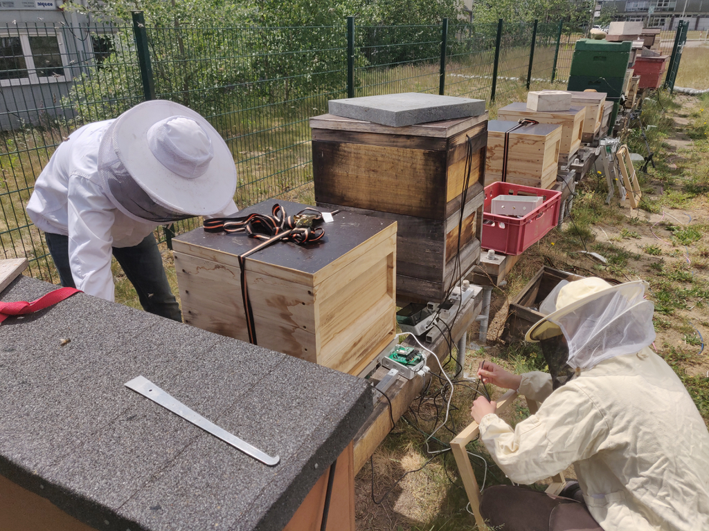{width=50%}

## Bot for a lovely, chaotic shared flat

{width=75%}

"Its Wednesday. Somebody has to bring the trash cans to the front of the house."

## Shopping Aid

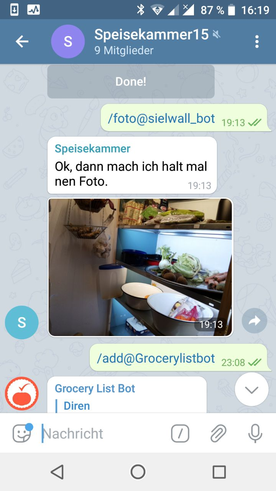{width=25%}

What do we need to buy?

## Work in progress - watering my garden

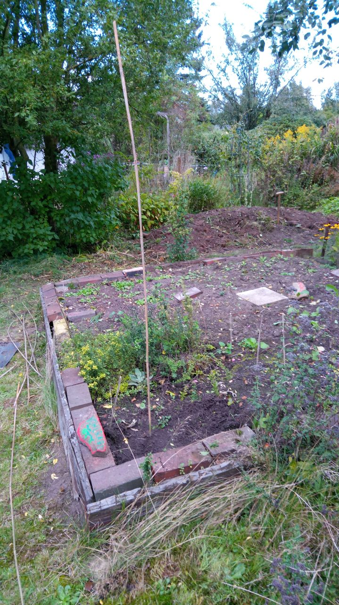{width=25%}
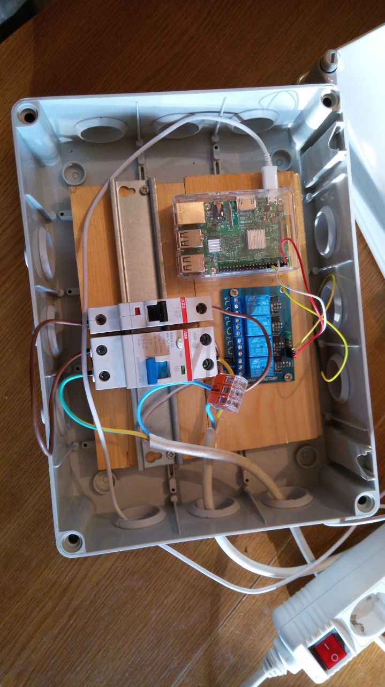{width=25%}

# Raspberry, Telegram, Grafana

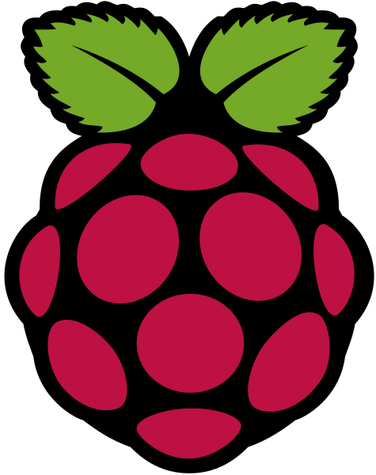{width=25%}
{width=25%}
{width=25%}

## BME280
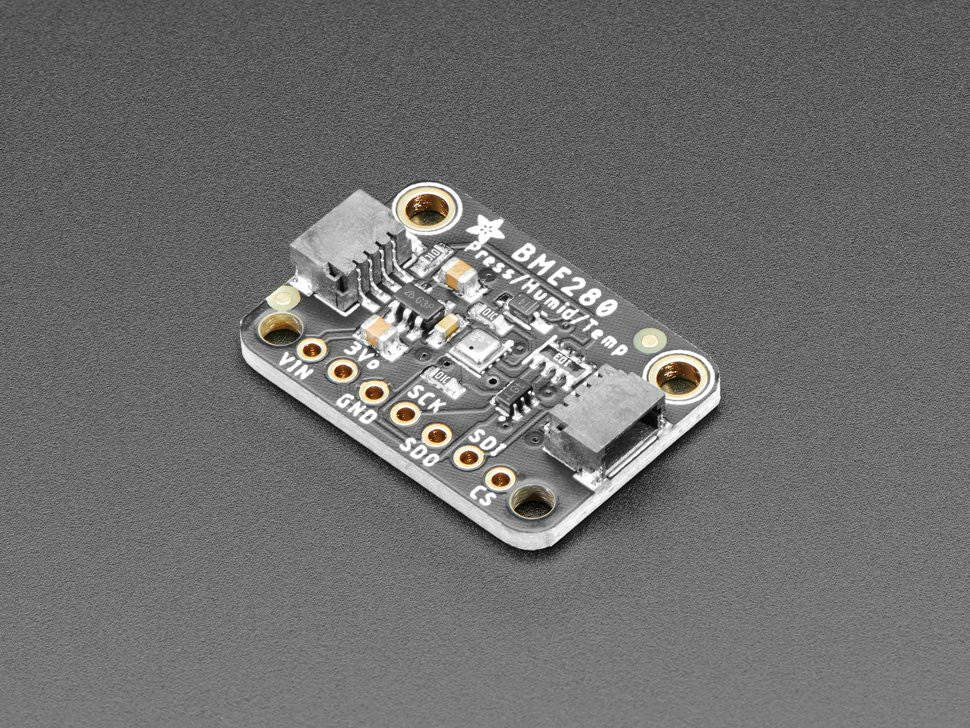{width=50%}

For temperature, humidity and pressure

# Introduction - Who are you?

## Introduction - Who are you?

- What's your background?
- Did you use telegram bots before?
- What's your motivation to participate in the course?

# More projects

## Simple Timelapse Camera Using Raspberry Pi and a Coffee Tin
[Link to "Instructables"] (https://www.instructables.com/Simple-timelapse-camera-using-Raspberry-Pi-and-a-c/)

## Touchscreen Internet Radio, Raspberry

[Link to "Instructables"] (https://www.instructables.com/Touchscreen-Internet-Radio-Raspberry/)

## And many more

[Link to "Instructables"] (https://www.instructables.com/circuits/raspberry-pi/projects/)

# Working with the Raspberry Pi

## Raspberry Pi as a Desktop Computer

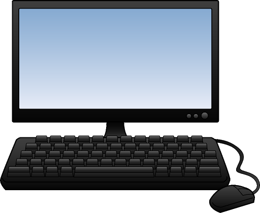{width=75%}

## Raspberry Pi as a Desktop Computer

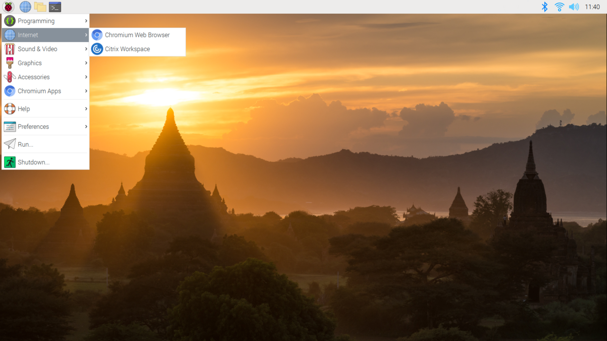{width=75%}

## Raspberry Pi and SSH

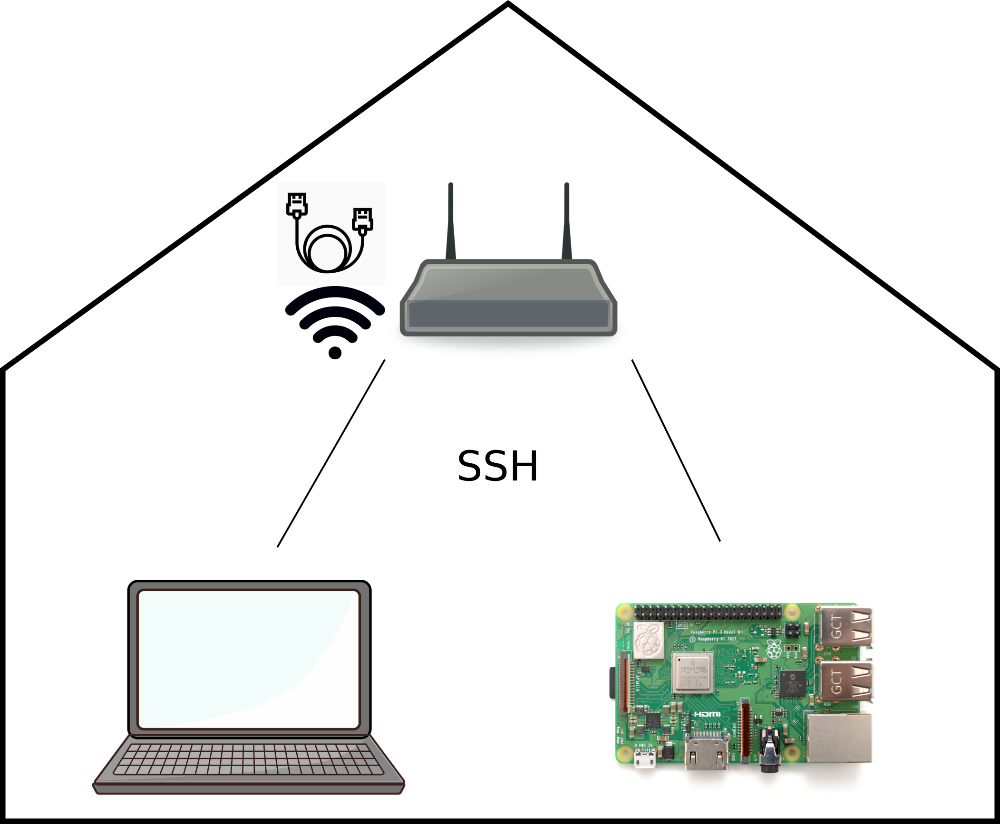{width=75%}

## Raspberry Pi and SSH

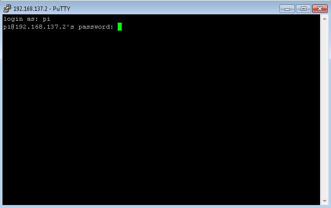{width=75%}

# Establish a Wifi-connection

## Option 1: Use keyboard, mouse and monitor

{width=50%}

It's not much different to a normal laptop.

## Option 2: Ethernet Cable

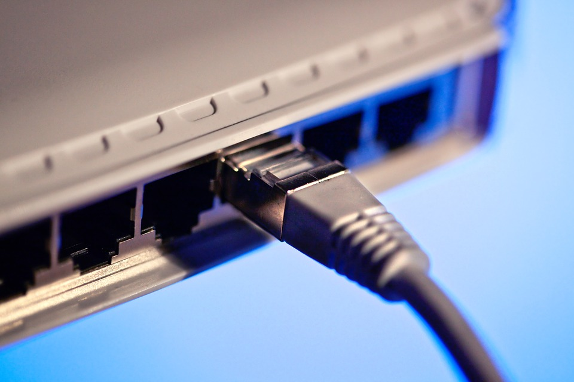{width=50%}

You need to be able to connect your Raspberry via ethernet, e.g. to your router.

## Option 3: Edit a config file on the SD-card

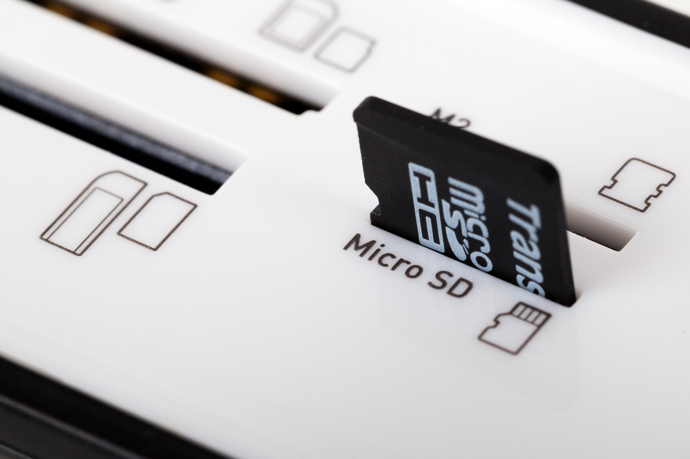{width=50%}

You need a card reader. 

## Option 4: Make a hotspot with your mobile phone

Make a hotspot with a certain name and password, connect your laptop to the same hotspot. Then use ssh.

# Making it work

## Making it work
- How do you want to use your Raspberry? SSH or monitor, keyboard, etc?
- How could you set up a wifi connection? Do you need an ethernet-cable?
- Which operating system do you use?

# Addresses

## Addresses

Please send me an e-mail with your address, so that I can send you the Raspberry Pis.

# Questions?

## Image Sources
Logos:
https://de.wikipedia.org/wiki/Datei:Raspberry_Pi_Logo.svg
https://de.wikipedia.org/wiki/Datei:Telegram_logo.svg
https://en.wikipedia.org/wiki/Grafana
SD-Card Reader: https://www.publicdomainpictures.net/de/view-image.php?image=25304&picture=micro-sd-karte-in-ein-lesegerat
Ethernet: https://pixabay.com/de/photos/ethernet-kabel-stecker-netzwerk-1157280/
SSH:
https://commons.wikimedia.org/wiki/File:Computer_with_mouse_and_keyboard.png, CC
https://en.wikipedia.org/wiki/Raspberry_Pi_OS#/media/File:Rapberry_Pi_OS_Screenshot.png, CC
https://commons.wikimedia.org/wiki/File:Raspberry_Pi_3_B%2B_(39906369025).png, CC
https://pixabay.com/de/illustrations/laptop-rechner-pc-online-5693660/
https://pixabay.com/de/vectors/router-netzwerk-switch-netzwerk-155899/
https://thenounproject.com/term/ethernet-cable/324759/
https://commons.wikimedia.org/wiki/File:Putty-windows-ssh-client-raspberry-pi-login.png

